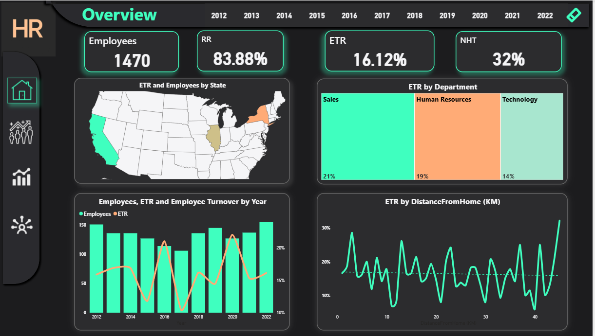
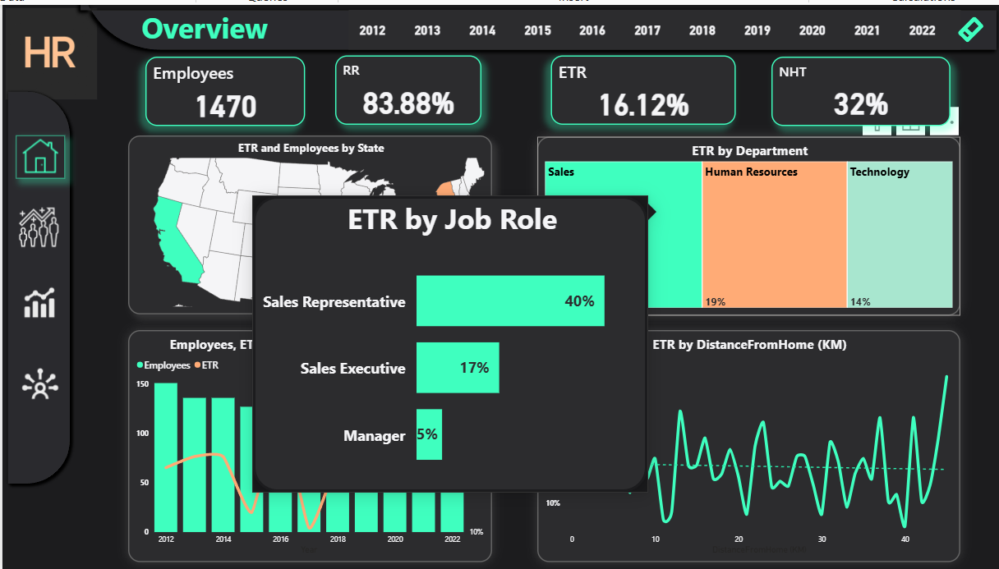
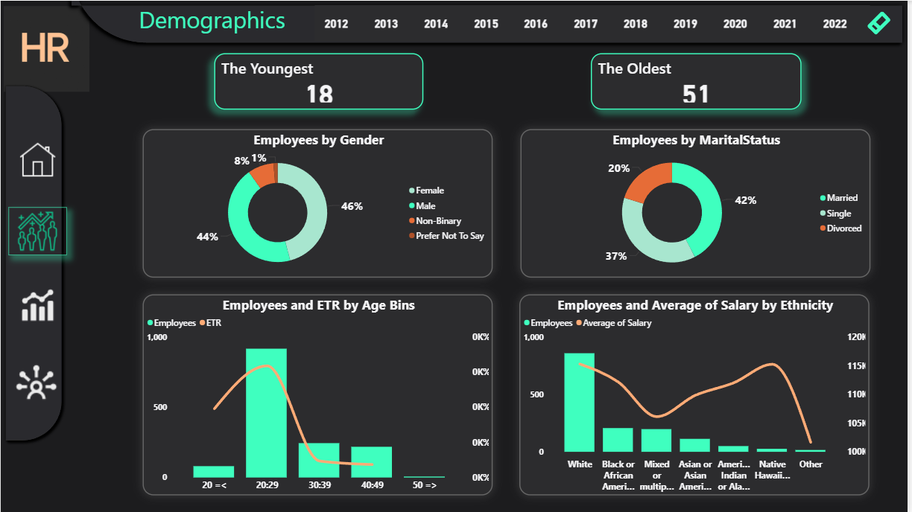
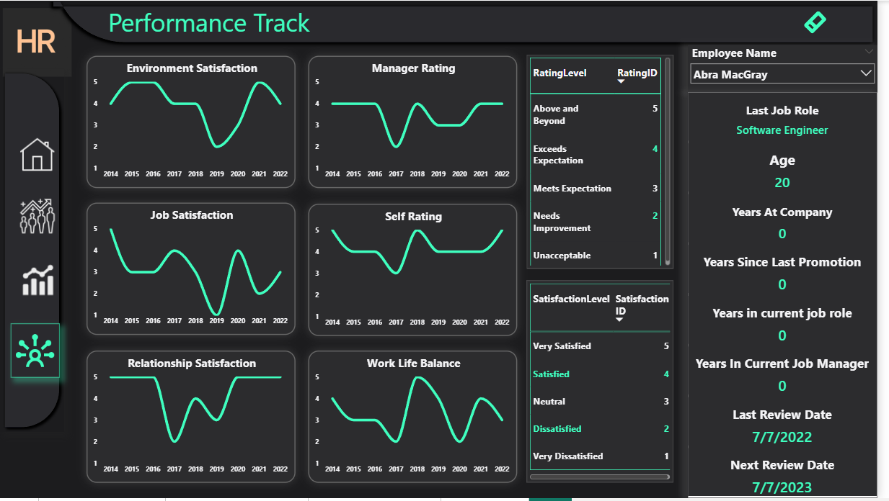
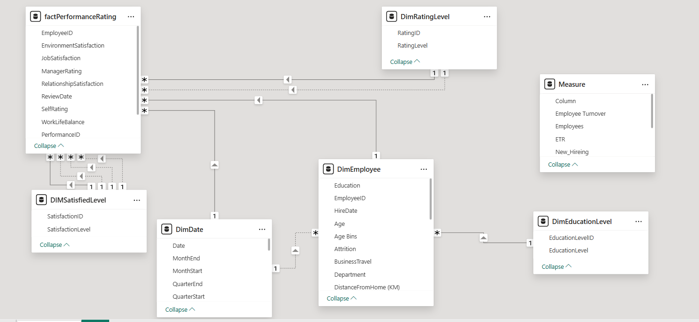

# 📊 HR Analysis — README (Source Code)

## 🧾 Project name

**HR Analysis** — Human Resources Analytics

## 🌐 Repository

🔗 [GitHub Repository](https://github.com/Abdallah101290/HR-Analysis)


## 🖼️ Dashboard Preview

### 🔹 Overview Page  


### 🔹 Demogravics Page  


### 🔹 Modeling Page  



---

## 📚 Table of contents

1. 🎯 Overview
2. 📂 Data Sources
3. 📈 Objectives & KPIs
4. 🧹 Data Cleaning (with sample code)
5. 🧩 Data Modeling (Star Schema recommendation)
6. 🔗 Relationships — active & inactive
7. 🧮 DAX Examples
8. ⚙️ Measures (Ready-to-use KPIs)
9. 💡 Insights
10. 🖥️ Dashboard & UX
11. 📁 Deliverables & Repository Structure
12. 📬 Contact

---

## 🎯 1. Overview

This project builds an **HR Analytics** dashboard in **Power BI**, enabling HR teams to monitor and analyze:

* Workforce size and structure
* Attrition, tenure, and diversity
* Hiring trends and cost of turnover

The repository includes cleaned data guidance, a recommended **Star Schema**, **DAX** measures for both active and inactive relationships, and **ready-to-use KPIs** for quick deployment.

---

## 📂 2. Data Sources

* 🧍‍♂️ `Employees.csv` — Employee personal & employment details
* 🏢 `Departments.csv` — Department hierarchy
* 🌍 `Locations.csv` — Location and region data
* 📅 `HR_Events.csv` — Event logs (promotions, terminations, transfers, etc.)
* 🧾 `Recruitment.csv` *(optional)* — Hiring process data
* 🕒 `DimDate` — Calendar/Date dimension (mandatory)

---

## 📈 3. Objectives & KPIs

**Objectives**

* Measure hiring, attrition, and retention efficiency
* Identify HR trends and potential risks
* Support data-driven HR decisions

**KPIs**

* 👥 Headcount
* 🆕 New Hires
* ❌ Terminations
* 🔁 Turnover Rate (Total / Voluntary / Involuntary)
* ⏱️ Time to Hire
* 🧭 Average Tenure
* 🧮 New Hire Turnover (NHT)
* 💰 Salary Avg/Median by Department
* 👩 Gender Diversity (%)
* 📉 Absence Rate

---

## 🧹 4. Data Cleaning (Power Query / SQL)

### 🔧 Power Query (M)

```m
let
  Source = Csv.Document(File.Contents("data/Employees.csv"),[Delimiter=",", Columns=20, Encoding=65001, QuoteStyle=QuoteStyle.Csv]),
  PromotedHeaders = Table.PromoteHeaders(Source, [PromoteAllScalars=true]),
  Trimmed = Table.TransformColumns(PromotedHeaders, {{"FirstName", Text.Trim}, {"LastName", Text.Trim}, {"JobTitle", Text.Trim}}),
  ChangedTypes = Table.TransformColumnTypes(Trimmed, {{"EmployeeID", Int64.Type}, {"HireDate", type date}, {"TerminationDate", type date}, {"Salary", type number}}),
  RemovedNullIDs = Table.SelectRows(ChangedTypes, each [EmployeeID] <> null),
  CleanStatus = Table.ReplaceValue(RemovedNullIDs, "active", "Active", Replacer.ReplaceText, {"Status"})
in
  CleanStatus
```

### 🧱 SQL (ETL)

```sql
INSERT INTO dim_employee (EmployeeID, FullName, HireDate, TerminationDate, DepartmentID, JobTitle, Gender, Salary)
SELECT
  TRY_CAST(EmployeeID AS INT),
  RTRIM(LTRIM(FirstName + ' ' + LastName)),
  TRY_CAST(HireDate AS DATE),
  TRY_CAST(TerminationDate AS DATE),
  DepartmentID,
  NULLIF(RTRIM(LTRIM(JobTitle)), ''),
  Gender,
  TRY_CAST(Salary AS DECIMAL(18,2))
FROM staging_employees
WHERE EmployeeID IS NOT NULL;
```

---

## 🧩 5. Data Modeling — Recommended: Star Schema

**Structure**

* ⭐ **Fact Table:** `FactHREvents` or `FactHeadcount`
* 🧱 **Dimensions:**

  * `DimEmployee`
  * `DimDepartment`
  * `DimDate`
  * `DimLocation`
  * `DimJobTitle`
  * (optional) `DimManager`

**Why Star Schema?**

* ⚡ Faster query performance
* 🧮 Simpler DAX logic
* 🧭 Easier user understanding

---

## 🔗 6. Relationships — Active & Inactive

**Active Relationships**

* `DimEmployee[EmployeeID]` → `FactHREvents[EmployeeID]`
* `DimDate[Date]` → `FactHREvents[EventDate]`

**Inactive / Indirect**

* Multiple date fields in a single fact table (e.g., HireDate, TerminationDate)
* Role-playing dimensions (e.g., Employee as Manager)

**Solutions**

* Use `USERELATIONSHIP()` in DAX for inactive relationships
* Use `TREATAS()` or `CROSSFILTER()` for advanced scenarios
* Use bridge tables for many-to-many relationships

---

## 🧮 7. DAX Examples

### Activate an inactive date relation

```dax
Terminations by TerminationDate =
CALCULATE(
  COUNTROWS(FactHREvents),
  FactHREvents[EventType] = "Termination",
  USERELATIONSHIP(DimDate[Date], FactHREvents[TerminationDate])
)
```

### Headcount at selected date

```dax
Headcount on Selected Date =
VAR selDate = SELECTEDVALUE(DimDate[Date])
RETURN
CALCULATE(
  DISTINCTCOUNT(DimEmployee[EmployeeID]),
  FILTER(
    DimEmployee,
    DimEmployee[HireDate] <= selDate &&
    (DimEmployee[TerminationDate] > selDate || ISBLANK(DimEmployee[TerminationDate]))
  )
)
```

---

## ⚙️ 8. Measures (Ready-to-use KPIs)

### 👥 Headcount

```dax
Headcount =
CALCULATE(
  DISTINCTCOUNT(DimEmployee[EmployeeID]),
  FILTER(
    DimEmployee,
    DimEmployee[HireDate] <= MAX(DimDate[Date]) &&
    (DimEmployee[TerminationDate] > MAX(DimDate[Date]) || ISBLANK(DimEmployee[TerminationDate]))
  )
)
```

### 🔁 Turnover Rate

```dax
Turnover Rate (%) =
VAR Terminated = [Terminations]
VAR AvgHeadcount = AVERAGEX(
  DATESINPERIOD(DimDate[Date], MAX(DimDate[Date]), -1, YEAR),
  [Headcount]
)
RETURN
DIVIDE(Terminated, AvgHeadcount, 0)
```

### ⏳ Average Tenure

```dax
Average Tenure (Years) =
AVERAGEX(
  FILTER(DimEmployee, NOT(ISBLANK(DimEmployee[HireDate]))),
  VAR endDate = IF(ISBLANK(DimEmployee[TerminationDate]), MAX(DimDate[Date]), DimEmployee[TerminationDate])
  RETURN DATEDIFF(DimEmployee[HireDate], endDate, YEAR)
)
```

---

## 💡 9. Insights (Examples)

1. 🏢 **Departments with highest turnover** → Identify top 3 for management focus
2. 🧑‍💼 **New Hire Early Attrition (NHT)** → Review onboarding process
3. 📍 **Tenure by manager** → Detect low-retention teams
4. 💸 **Cost of turnover** → Estimate total impact

Each insight is supported by DAX-driven measures and can be visualized with trend lines or conditional formatting.

---

## 🖥️ 10. Dashboard & UX Tips

* 🧭 Cover page with KPIs and date filters
* 🎚️ Slicers: Date, Department, Location, Manager
* 💬 Custom tooltips explaining KPIs
* 📈 Use line & bar charts for time-based trends
* 🚦 Conditional colors (e.g., high turnover in red)
* 🔍 Drill-through to department-level details

---

## 📁 11. Deliverables & Repository Structure

```
/HR-Analysis
  /data
    Employees.csv
    Departments.csv
    HR_Events.csv
  /screenshots
    cover1.png
    cover2.png
    model_view.png
  HR-Analysis.pbix
  README.md
  data_dictionary.md
  DAX_measures.md
```

---

## 📬 12. Contact

👤 **Abdallah Elshokey**
🔗 [LinkedIn](https://www.linkedin.com/in/abdallah-elshokey-230b95225)
💻 [GitHub](https://github.com/Abdallah101290)

---

### 🏁 Final Notes

This README is fully formatted and ready for GitHub upload.
To enhance it further, you can:

* Add badges (e.g., Power BI | DAX | Data Modeling) at the top
* Include GIF previews of dashboard interactions
* Add a `data_dictionary.md` or `DAX_measures.md` for deeper documentation

✨ *Designed & documented by Abdallah Elshokey — HR Analytics Project* ✨
